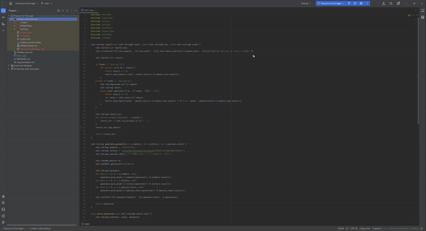

# Password Vault


## Description
Password Vault is a simple C++ program that allows for generating strong passwords and storing encrypted login details for various platforms.

## Features

1. **Password Generation** - Generates a random, strong password composed of a specified number of digits, letters, and special characters.

2. **Password Storage** - Stores encrypted login details (platform, username, password) in a `vault.txt` file.

## Usage

1. Run the program and provide the Master Key, which is used for encryption.
2. Choose one of the options:
    - `1. Generate Password`: Enter the desired number of digits, letters, and special characters for your new password. The password will be generated and displayed.
    - `2. Store Password`: Enter the platform name, username, and password that you wish to store. These details will be encrypted using your Master Key and saved in the `vault.txt` file.
    - `3. Exit`: Exit the program.

## Code
The complete C++ code is provided in the repository.

## Dependencies
The program is dependent on C++ Standard Libraries only. Make sure your compiler supports C++14 or later.

## Compilation
Compile the program with a C++ compiler. For example, using g++:

```bash
g++ main.cpp -o main